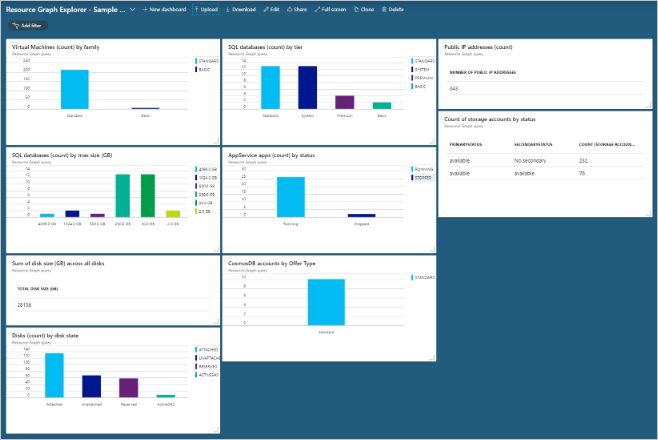

# Azure Resource Graph Explorer - Portal dashboard #2

An Azure portal dashboard that provides insights to your Azure environment with [Azure Resource Graph
Explorer](https://docs.microsoft.com/azure/governance/resource-graph) queries and visualization.

## Running the sample

1. Download the sample Azure portal dashboard definition file
   (`resourcegraphexplorer-sample-2.json`).

1. In Azure portal, select **Dashboard** from the left pane.

1. Select **Upload**, then locate and select the downloaded sample dashboard file. Then select
   **Open**.

The imported dashboard is automatically displayed. Since it now exists in your Azure portal, you may
explore and make changes as needed or create new dashboards from the example to share with your
teams. For more information about working with Azure portal dashboards, see
[Create and share dashboards in the Azure portal](https://docs.microsoft.com/azure/azure-portal/azure-portal-dashboards).

## Contributing

This project welcomes contributions and suggestions. Most contributions require you to agree to a
Contributor License Agreement (CLA) declaring that you have the right to, and actually do, grant us
the rights to use your contribution. For details, visit https://cla.opensource.microsoft.com.

When you submit a pull request, a CLA bot will automatically determine whether you need to provide a
CLA and decorate the PR appropriately (e.g., status check, comment). Simply follow the instructions
provided by the bot. You will only need to do this once across all repos using our CLA.

This project has adopted the [Microsoft Open Source Code of Conduct](https://opensource.microsoft.com/codeofconduct/).
For more information see the [Code of Conduct FAQ](https://opensource.microsoft.com/codeofconduct/faq/)
or contact [opencode@microsoft.com](mailto:opencode@microsoft.com) with any additional questions or
comments.